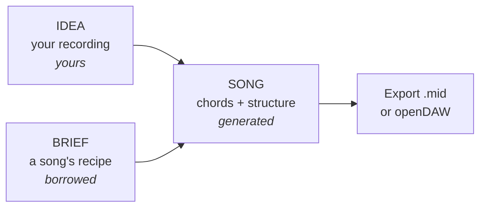
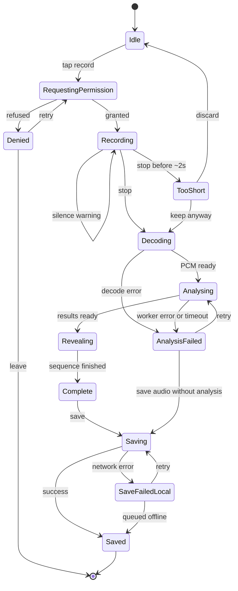
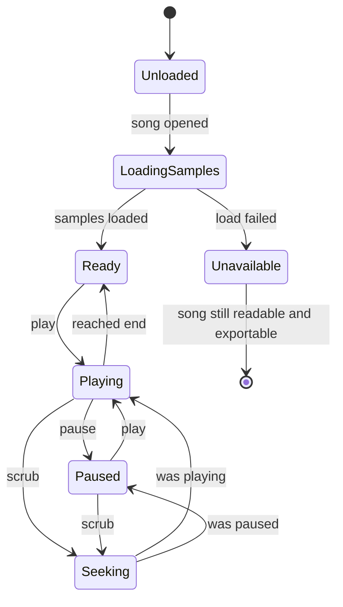
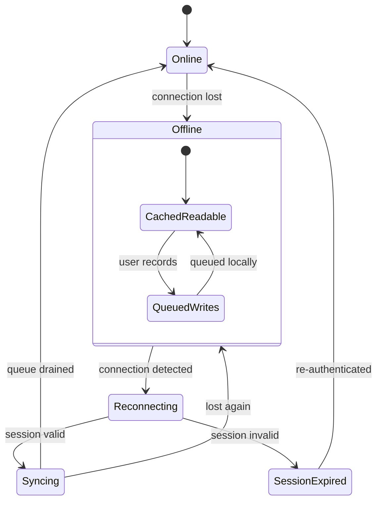

# Memo — UX Flow Handoff

**Date:** 2026-07-20
**For:** whoever is designing and building Memo's UI
**Status:** flow is a contract · visuals are yours

---

## Part 0 — How to read this

### What this document is

Memo's **behaviour**: what screens exist, what happens on them, what order things occur in, what can go wrong, and what the user must never be lied to about.

### What is a contract vs. what is your call

| This document decides | You decide |
|---|---|
| What screens exist and how you get between them | What they look like |
| What information appears on each screen | Layout, hierarchy, spacing |
| What states each screen must handle | How each state is expressed visually |
| The order events happen in, and their timing | Motion, easing, transitions |
| What the user is told, and how honest it is | Wording tone, typography, colour |
| Data shapes flowing in and out (Part 6) | Component structure and naming |

**One exception, clearly fenced.** Part 7 is a UI direction annex holding the product owner's visual intent. It is explicitly *not* contract — adopt it, adapt it, or argue with it. It's there so you know what was in their head, not to constrain you. Everything in Parts 1–6 remains binding.

If something in Parts 1–6 forces a visual decision, that's a bug in this document — tell me and I'll rewrite it. If you want to change a *flow*, that's a conversation, because several of these choices are load-bearing for how the product is judged (see Part 5.5).

A prior visual system exists at `docs/superpowers/specs/2026-07-20-memo-frontend-design.md`. **It is reference material, not a requirement.** Ignore its aesthetics freely. One thing from it is worth stealing regardless of your visual direction: it records a real accessibility failure where 10px labels were set in a light grey measuring 2.68:1 against the background, against a required 4.5:1. Small text needs 4.5:1 contrast. Don't put labels in your lightest grey.

### Glossary

Memo's users include people who don't read music, and so do its judges. These terms appear throughout.

| Term | Meaning |
|---|---|
| **Key** | The "home base" a song lives in (C major = brighter, A minor = sadder). Determines which chords fit. |
| **BPM / tempo** | Speed in beats per minute. 60 = slow ballad, 120 = pop, 160+ = fast. |
| **Chord** | Several notes sounding together — the backing under a melody. |
| **Chord progression** | The order chords move in. A song's harmonic backbone. |
| **Melody** | The tune you'd hum. |
| **Structure** | The section map: intro → verse → chorus → bridge → outro. |
| **MIDI** | Editable digital "sheet music" — which note, when, how long. Not a recording. |
| **DAW** | Full studio software for producing a finished track. openDAW is a free browser one. |
| **MIR** | Music Information Retrieval — extracting musical facts from audio. What Essentia does. |
| **Essentia** | The analysis engine. Runs in the browser, in a Web Worker. |

### Priority tiers

Everything is specified, but not everything is equal. The build window is 2.5 days.

- **Tier 1 — the core loop.** Capture → Bank → Build. If only this works, there's still a product and a demo. Specified in full.
- **Tier 2 — supporting.** Auth, search/filter, visualiser, timer. Specified at medium depth.
- **Tier 3 — drop-if-short.** openDAW embed, multi-track upload. Specified at outline depth, each with a stated fallback that must look intentional rather than broken.

---

## Part 1 — Product model

Memo has exactly **three nouns**. Almost every confusion in this product comes from blurring them.

### Idea

**A recording of you, plus what the app worked out about it.**

You hum, sing, or play. Memo stores the audio and automatically derives: key, tempo, what you played it on, a mood word, and the notes you sang. You give it a name, or accept the one it suggests.

> *"A voice memo with perfect pitch."*

An Idea is **yours**. It's raw material. It is never edited by the app after creation — only re-titled.

### Brief

**A song you love, taken apart.**

You name a track (or upload one). Memo finds it, analyses a clip, and extracts its recipe: key, tempo, chord progression, and section map.

> *"Reverse-engineer a song you love."*

A Brief is **borrowed**. It's a template, not content. Nothing you record goes into it.

### Song

**An Idea arranged using a Brief's recipe.**

Memo maps your melody onto the reference's structure and returns chords, a section order, and suggested instrumentation you can hear played back — and export.

> *"The matchmaker."*

### The whole app in one line

> **An Idea plus a Brief makes a Song.**



### Design consequences

These follow directly from the model and should hold in any visual treatment:

1. **Ideas and Briefs must never look like the same kind of object.** One is a recording of the user; the other is a reference track. If a user confuses them, the Builder makes no sense.
2. **A Song always shows its parents.** Which Idea, which Brief. It's derived, and hiding that makes the output feel arbitrary.
3. **The Builder needs one of each.** Its empty state is not "no songs" — it's "pick an Idea and a Brief," which means it's a *chooser* before it's a *viewer*.

### Information architecture

Three top-level destinations. Briefs deliberately do **not** get one — a Brief is only ever useful in service of building a Song, and promoting it to a peer of Ideas implies otherwise.

```
Ideas    — the library of your recordings
Record   — capture (the primary action)
Songs    — what you've built (Briefs live inside this flow)
```

---

## Part 2 — Journeys

Four end-to-end paths. Each step is: **user action → system response → what's on screen → what can go wrong.**

### J1 — Cold start (first-ever use)

**Target: under 30 minutes to a song.** This is the honest first-run path and one of the two timed numbers the product is judged on.

| # | User does | System does | On screen | Failure mode |
|---|---|---|---|---|
| 1 | Opens Memo | Loads app shell | Sign-in | Offline → shell loads, sign-in unavailable, say so |
| 2 | Enters email | Sends magic link | "Check your email" + the address used | Send fails → error + retry, keep the address |
| 3 | Clicks link in email | Authenticates, lands in app | Empty Ideas | Expired link → re-request, don't lose context |
| 4 | Sees empty library | — | Empty state explaining what goes here + route to Record | — |
| 5 | Taps Record | Requests mic permission | OS permission prompt | Denied → recovery state (Part 5.3) |
| 6 | Grants permission, hums | Records, shows live audio | Recording + elapsed time | Silence → still record; flag at analysis |
| 7 | Taps stop | Analyses in worker | Analysing state | Takes >6s → progressive messaging (Part 5.1) |
| 8 | Waits ~2–5s | Reveals results in sequence | Input → tempo → key → mood | Low confidence → mark it (Part 5.5) |
| 9 | Accepts or edits title | Saves Idea | Saved confirmation, Idea appears in library | Save fails → keep local, retry, never lose audio |
| 10 | Goes to Songs | — | "Pick an Idea and a Brief" | — |
| 11 | Picks the Idea | — | Brief chooser | — |
| 12 | Searches a track | Queries iTunes | Results with artwork | No results → suggest upload |
| 13 | Picks a track | Fetches + analyses preview | Analysing | Preview missing → offer upload (Part 5.3) |
| 14 | Reviews the recipe | — | Brief: key, tempo, chords, sections | Weak segmentation → `estimated` marker |
| 15 | Taps Build | Requests arrangement | Building | Request fails → retry, keep both inputs |
| 16 | Sees the song | — | Structure map + chords + instrumentation | — |
| 17 | Plays it | Starts playback | Transport running, current section indicated | Audio fails → export still offered |
| 18 | Exports | Generates .mid | Download / openDAW handoff | Embed fails → .mid alone, presented as complete |

### J2 — Warm start (the demo path)

**Target: under 10 minutes. This is the path judged live.** It assumes a pre-seeded library and a cached Brief.

| # | User does | System does | On screen | Notes |
|---|---|---|---|---|
| 1 | Opens Memo (already signed in) | Restores session | Ideas, populated | **Session must survive.** Re-auth on stage is a failure. |
| 2 | Picks a banked Idea | — | Idea detail + replay | Must be reachable in one tap from launch |
| 3 | Taps Build from the Idea | — | Brief chooser, recents first | **Cached Brief must be top of list** |
| 4 | Picks the cached Brief | Loads instantly (no re-analysis) | Building | Re-analysing a cached Brief on stage is a bug |
| 5 | Waits | Requests arrangement | Building | The one unavoidable wait — see Part 5.1 |
| 6 | Sees the song | — | Structure + chords + instrumentation | — |
| 7 | Plays it, sings over it | Playback with section tracking | Transport, current section | Must survive being left playing while talking |
| 8 | — | — | Completion stamp with stage timings | The proof (Part 5.5) |
| 9 | Optionally exports | — | openDAW / .mid | Optional — never block the finish on it |

**Demo-critical requirements**, all of which are UX rather than visual:

- Nothing on this path may require typing. Typing on stage is slow and error-prone.
- No step may depend on a network call that isn't already cached, except the arrangement request.
- Any state that can appear here must be reachable and testable beforehand.
- Playback must tolerate being started, left running, and talked over.

### J3 — Reverse-engineer (Brief-first)

Some users arrive wanting to take a song apart, not to record. The flow must support entering from that direction.

| # | User does | System does | On screen | Failure mode |
|---|---|---|---|---|
| 1 | Goes to Songs → new | — | Chooser: Idea, Brief | — |
| 2 | Starts with Brief | — | Search / upload | — |
| 3 | Searches a track | Queries iTunes | Results | None → upload |
| 4 | Picks one | Analyses preview | Analysing | No preview → upload (Part 5.3) |
| 5 | Reads the recipe | Saves the Brief | Ingredients + method | Weak sections → `estimated` |
| 6 | — | — | "Now pick an Idea" | If library empty → route to Record |

The Brief is genuinely useful on its own — a user may stop here, having learned a song's chords. **Don't design it as a dead end.** It should read as complete, with building as an offer rather than a requirement.

### J4 — Returning user (the habit loop)

The journey that justifies the product's existence. It is the *most common* real path and the *least* demoed one.

| # | User does | System does | On screen | Notes |
|---|---|---|---|---|
| 1 | Opens Memo | Restores session | Ideas | Should feel instant — cached shell |
| 2 | Records a quick idea | Analyses, saves | Record → reveal → saved | Under 30s end to end |
| 3 | Leaves | — | — | **Capture must be satisfying on its own** |
| — | *or* | | | |
| 3 | Filters the library | Filters in place | Filtered list | By mood, key, tempo, input type |
| 4 | Replays a few | Plays inline | Playing indicator on the row | Must not navigate away to play |
| 5 | Picks one, builds | — | Builder | — |

**The most important line in this document:** most sessions end at step 3. A user who hums an idea at 1am and closes the app must feel the app did its job. If capture only feels worthwhile when it leads to a Song, the product fails at being a habit — and the "personal/real habit" criterion is the single heaviest one in the judging.

---

## Part 3 — Screen inventory

For each screen: purpose, required content, what the user is deciding, entries and exits, and **every state that must be designed**.

---

### TIER 1 — CORE LOOP

---

### 3.1 Record

**Purpose:** capture an idea before it's forgotten. The single most important screen.

**User is deciding:** nothing. This screen exists to get out of the way. Any decision placed here is a design failure — the user has a melody in their head and a few seconds before it's gone.

**Entry:** Record tab · empty-library prompt · OS shortcut
**Exit:** analysis reveal (on stop) · abandon (leaves nothing)

**Must contain:**
- An unmistakable record control, reachable by thumb
- Elapsed time while recording
- Live visual feedback that audio is being heard
- A way out that doesn't save

**Must not contain:** settings, options, format choices, quality pickers, or anything that delays the first tap.

**Recording begins on touch-down.** If the record control has an entry animation, capture starts when the finger lands, not when the animation settles. Decoration runs over an already-live recorder, never in front of one. A user with a melody in their head has a few seconds before it's gone; an animation that costs them the first bar has broken the product's core promise. This is testable — assert that the recorder is running before the animation completes.

**States:**

| State | Behaviour |
|---|---|
| Idle | Ready. One obvious action. |
| Permission pending | OS prompt; explain why the mic is needed *before* triggering it |
| Permission denied | Recovery state — see Part 5.3 |
| Recording | Elapsed time, live audio feedback, stop available |
| Recording — no signal | Detectably silent for >3s: warn, keep recording, never auto-stop |
| Stopping | Brief; must not feel like a hang |
| Analysing | See 3.2 |
| Too short | Under ~2s: offer to discard or keep, never silently discard |
| Unsupported browser | No MediaRecorder: explain plainly, offer upload |

**Live audio feedback** is required — it's how the user knows they're being heard, and its absence reads as a broken app. Its *form* is entirely yours. Two constraints: it must run independently of analysis (never blocking or blocked), and it must degrade to something static rather than freezing if it can't keep up on a mid-range phone.

---

### 3.2 Analysis reveal

**Purpose:** the payoff. This is where Memo proves it did something real rather than saving a file.

**User is deciding:** whether to trust the result, and whether to correct the title.

**Entry:** stopping a recording
**Exit:** save (→ library) · discard · re-record

**Behaviour — this sequencing is a contract:**

Results appear **in order, one at a time**, roughly 300–400ms apart:

```
1. Input type   (hum / vocal / guitar / other)
2. Tempo        (BPM)
3. Key          (e.g. A minor)
4. Mood         (a word)
```

Two reasons this ordering is fixed. It matches the order the analysis actually stabilises, so it isn't theatre. And staging the reveal makes measurement *legible* — values appearing together read as a lookup, values arriving in sequence read as work being done.

**The honesty requirement:** input type, tempo and key are **measured** by the DSP. Mood is **inferred** by a language model. These must be visually distinguishable, and mood arrives last. How you express the distinction is yours; that it exists is not optional. The product's central claim is that it measures rather than guesses, and quietly mixing a generated value into measured ones undermines exactly that claim to the audience most likely to check.

**States:**

| State | Behaviour |
|---|---|
| Analysing | Progress; see Part 5.1 for the latency policy |
| Revealing | Staged sequence above |
| Complete | All values shown, title editable, save available |
| Low confidence | Any value the analysis isn't sure of is marked — see Part 5.5 |
| Failed | Analysis errored: **audio is still saved**, values marked unknown, retry offered |
| Editing title | Inline, pre-filled with a suggestion, selecting-all on focus |

**Failure rule:** a failed analysis must never lose the recording. The audio is the irreplaceable part; the analysis can be retried. This is the single most important error-handling rule in the app.

---

### 3.3 Ideas (library)

**Purpose:** make a pile of recordings into something searchable. This screen *is* the "200 unlabelled voice memos" argument.

**User is deciding:** which idea to revisit.

**Entry:** Ideas tab · after saving · post-auth
**Exit:** idea detail · build · record

**Each entry must show:** title, key, tempo, mood, duration, and **a visual identity derived from its own audio**.

That last one matters more than it looks. Without it every row is interchangeable text and the user must play each one to find anything — which defeats the screen's purpose. The identity should be *derived from the actual waveform* so it's genuinely unique per recording. Its form is yours; the prior spec used an angular amplitude profile specifically to avoid looking like the generic rounded-bar waveform every audio app ships, but any distinctive derived form satisfies this.

**Density floor: at least eight entries visible on a phone.** This screen's entire argument is "200 recordings, tidy and findable." Any treatment that shows three or four at a time argues the opposite, however good it looks. If a richer presentation can't hit eight, it becomes an optional view alongside a dense default — never the default itself.

**Tap semantics — two distinct targets.** Playing and opening are different intents and must not share a target:

- **Play** is its own control on the entry. Playback is inline; it never navigates away.
- **Press anywhere else** expands the entry in place, revealing its full contents (below). Expansion is an accordion, not a navigation — the list stays on screen, and more than one entry may be open at once so takes can be compared.

**Expanded entry must contain:** the full waveform, every detected value, **notes and lyrics (editable)**, any Songs derived from this Idea, and a build action.

Notes and lyrics are free text the user writes. They are the only user-authored content in an Idea besides its title, and they're often what turns a hummed fragment into a song — the words, or a reminder like "try this in 6/8." Treat them as first-class: editable inline, saved like any other write, queued when offline.

**Filtering:** by mood, key, tempo, input type. Filters apply in place — no modal, no separate results screen, no navigation. Clearing filters must be one action.

**States:**

| State | Behaviour |
|---|---|
| Populated | List, newest first |
| Empty (first run) | Explain what lands here and route to Record. Inviting, not apologetic. |
| Empty (filtered) | Distinct from first-run empty — say which filter is excluding things and offer to clear |
| Loading | Skeleton preserving final layout; no reflow on arrival |
| Playing | The playing row is indicated; playback is inline, never navigates away |
| Expanded | Full contents shown in place; other entries stay visible; collapsing is one action |
| Editing notes/lyrics | Inline text entry; saves without an explicit save button; never blocks playback |
| Notes/lyrics unsaved | Edit not yet persisted (offline or in flight) — say so, keep the text, retry |
| Failed to load | Cached entries shown if available, staleness stated |
| Offline | Cached entries playable; actions requiring network disabled **with a stated reason** |

---

### 3.4 Brief

**Purpose:** show a reference song's recipe, comprehensibly to someone who doesn't read music.

**User is deciding:** is this the right template for my idea?

**Entry:** builder flow · Songs → new
**Exit:** build with this Brief · pick another · leave (Brief is saved)

**Must contain:** track identity (title, artist, artwork), key, tempo, chord progression, section map, and **where the analysis came from** — a 30-second preview or a full uploaded file. That provenance is not decoration: a section map derived from a 30s preview is far weaker than one from a full track, and the user deserves to know which they're looking at.

**Framing:** ingredients (key, tempo, chords) then method (section order). The cooking metaphor is deliberate — it's immediately legible to non-musicians, which several judging criteria depend on. Keep measured values presented as measurements so the warmth of the framing doesn't cost technical credibility.

**States:**

| State | Behaviour |
|---|---|
| Searching | Query in progress |
| Results | Track candidates with enough info to disambiguate covers and remasters |
| No results | Suggest upload; never a dead end |
| Analysing | Progress; see Part 5.1 |
| Complete | Full recipe |
| **Sections estimated** | Self-similarity was unreliable and fixed-length fallback was used. **Must be visibly marked.** See Part 5.5. |
| No preview available | Track has no playable clip → offer upload, explain in one plain sentence |
| Analysis failed | Retry, or upload instead |
| Upload in progress | Progress + cancel |
| Upload rejected | State the actual reason (format, size) |

---

### 3.5 Song Builder

**Purpose:** turn an Idea plus a Brief into something you can hear and take away. The screen the pitch lands on.

**User is deciding:** is this a song I want to keep working on?

**Entry:** build from Idea · build from Brief · Songs list
**Exit:** play · export · openDAW · back

**Structure leads.** The section map is the spine of the screen — sections in order, each opening to reveal its chords. Not the reverse.

This is a real decision, not a layout preference. A chord grid is only meaningful to someone who reads chords. A section map — *intro, verse, chorus* — is meaningful to everyone, and one of your judging criteria is explicitly about non-musicians understanding the output. Leading with structure means a judge who has never played an instrument can follow the whole screen; leading with chords means they can't.

**Must contain:** section order, chords within each section, instrumentation, playback, export, and **both parents** (which Idea, which Brief).

**States:**

| State | Behaviour |
|---|---|
| Choosing inputs | Needs an Idea and a Brief; show what's still missing |
| Building | Arrangement request in flight; see Part 5.1 |
| Complete | Full song |
| Playing | Current section indicated; position visible; must survive being left running |
| Paused | Position retained |
| Build failed | Retry with both inputs preserved — never make the user re-pick |
| Playback unavailable | Audio failed: the song is still readable and exportable. **Never block export on playback.** |
| Exporting | Progress |
| Export complete | Confirm, and say where the file went |

**Section colour-coding** is expected (it's how the map is scannable at a glance) but colour must **never be the only carrier of meaning** — every section stays labelled with its name. Roughly 1 in 12 men has a colour vision deficiency, and stage projectors crush mid-tones unpredictably.

---

### TIER 2 — SUPPORTING

---

### 3.6 Auth

Magic-link only. No passwords.

**States:** signed out · email entered · link sent ("check your email", showing the address) · link expired · authenticating · signed in · sign-out confirmation.

**Requirement:** the session must survive an app restart. Re-authenticating during a live demo is a failure mode with no recovery.

---

### 3.7 Transport (playback)

Persistent whenever a song is loaded, not a per-screen control. It must survive navigation within the Songs area.

**Must contain:** play/pause, elapsed position, a way to seek, and an indication of where you are in the song's structure.

**States:** stopped · playing · paused · seeking · loading samples · unavailable (with reason).

**Requirement:** starting playback must not require the screen to stay untouched. During a demo it will be started and then talked over while the presenter looks elsewhere.

---

### 3.8 Time-saved proof

Memo stamps timings at each stage and presents them **on the finished song only** — there is no timer running in the UI during the flow.

That's a deliberate trade: a permanently visible timer makes the app feel like a demo instrument rather than a tool someone actually uses, which costs more on the heaviest judging criterion than it gains on the time-saved one.

To keep the claim credible without a running clock, show the **stage breakdown**, not just a total:

```
captured  0:00
analysed  0:14
brief     1:31
built     8:42          vs ~3–4 hrs by hand
```

A single total is an assertion. A breakdown reads as instrumentation, and it's much harder to disbelieve.

---

### 3.9 Install (PWA)

Installable to home screen, launching fullscreen. The app shell works offline.

**States:** not installed (prompt available) · prompt dismissed (don't nag) · installed · offline (see Part 5.4).

---

### TIER 3 — DROP IF SHORT

---

### 3.10 openDAW handoff

One action that opens the song in a browser DAW with tracks pre-built.

**Fallback — and this is the important part:** if the embed is dropped, `.mid` export alone must read as a **complete, intentional ending**, not a missing feature. Design the export action so it stands on its own, and never surface openDAW-shaped gaps when it's absent. Your memo's own risk list names this as the first thing cut if the clock wins, so the fallback is the likely shipping state, not a contingency.

**States:** available · loading · unsupported (mobile → offer `.mid`) · failed (→ `.mid`).

---

### 3.11 Multi-track upload

Upload 1–3 files for a stronger Brief than a 30-second preview allows.

**States:** idle · uploading (progress + cancel) · analysing · complete · rejected (state the real reason) · partial success (some files analysed — say which).

---

## Part 4 — State machines

The three flows with enough concurrency to be built wrong from prose.

### 4.1 Recording and analysis lifecycle

The subtle part: **recording, analysis, and saving overlap.** Analysis runs in a Web Worker while the UI stays responsive, and the audio must be preserved independently of whether analysis succeeds.



**Invariants — these must hold in any implementation:**

1. Audio is never discarded because analysis failed. `AnalysisFailed → Saving` must exist.
2. Analysis never blocks the UI thread. Live audio feedback keeps running throughout.
3. A save that fails for network reasons queues rather than losing data.
4. `TooShort` always offers a choice. Never silently discard a user's recording.

### 4.2 Playback transport



**Invariant:** `Unavailable` is not a dead end. A song whose audio won't load is still fully readable and exportable. Playback is an enhancement to the Song, not the Song itself.

### 4.3 Connectivity and sync



**Invariants:**

1. Offline never blocks **recording**. Capture is the core promise and it must work on a plane, in a basement, at a festival.
2. Offline **does** block building — it needs the network — and this must be stated, not silently failing. A disabled control with no explanation reads as a bug.
3. Queued recordings survive a full app restart.

---

## Part 5 — Cross-cutting rules

### 5.1 Latency policy

Real analysis takes real time. Essentia on a mid-range phone: roughly 1–4s for a short hum, longer for a full track. The arrangement request adds a network round trip. **Pretending this is instant is the fastest way to make the app feel broken.**

| Duration | Treatment |
|---|---|
| <300ms | Nothing. Don't flash a spinner. |
| 300ms–1s | Simple busy indication |
| 1–5s | Busy indication **plus what's happening** — "Working out the key and tempo" |
| >5s | Progressive detail: name the stage being worked on |
| >15s | Offer a way out — cancel or retry — but keep working underneath |

**Rules:**

- Never show a percentage you can't honestly compute. A progress bar that jumps 0→90→hang is worse than no bar.
- Layout must not reflow when results arrive. Reserve the space up front.
- Describe the *stage*, not the technology. "Finding the beat" beats "Running RhythmExtractor2013" — the second means nothing to a judge and everything can fail behind it.

### 5.2 Error taxonomy

Every error needs a **cause**, a **consequence**, and a **next action**. "Something went wrong" satisfies none of the three.

| Class | Example | User is told | Recovery |
|---|---|---|---|
| Permission | Mic denied | What's blocked and why it's needed | Steps to re-enable |
| Capability | No MediaRecorder | This browser can't record | Upload instead |
| Input | Recording too short | It was very short | Keep or discard |
| Analysis | Essentia failed | Couldn't work out the details — **audio is saved** | Retry analysis |
| Confidence | Weak segmentation | Sections are estimated | Accept or upload full track |
| Network | Save failed | Not saved yet — **held locally** | Auto-retry, manual retry |
| Auth | Link expired | Link is no longer valid | Request another |
| Write | Notes/lyrics not saved | Edit is held locally, not lost | Auto-retry; text stays on screen |
| Upstream | No preview for track | This track has no playable clip | Upload, or pick another |
| Generation | Arrangement failed | Couldn't build this time | Retry, inputs preserved |

**Rule:** never present an error that discards user work as a mere notification. If audio, a title, or a selection is at risk, saying so *is* the error message.

### 5.3 Permissions and dead ends

**Microphone** is the only permission Memo requests. Explain why *before* triggering the OS prompt — a prompt arriving with no context is the most common cause of denial, and once denied it's expensive to recover on mobile.

If denied, the app is not over: the upload path still works. Every dead end in Memo has an escape hatch, and they should be designed with the same care as the happy paths, because they're what a judge hits when the wifi misbehaves.

| Dead end | Escape |
|---|---|
| Mic denied | Upload a file |
| Browser can't record | Upload a file |
| Track has no preview | Upload the track |
| Search finds nothing | Upload, or search again |
| Analysis failed | Retry, or save audio unanalysed |
| Playback unavailable | Read and export the song |
| openDAW unavailable | Export `.mid` |

### 5.4 Offline behaviour

The app shell is cached and launches offline.

| Capability | Offline |
|---|---|
| Launch the app | ✅ |
| Record | ✅ queued |
| Analyse | ✅ analysis is local (this is a genuine advantage — say so) |
| Play cached ideas | ✅ |
| Browse the library | ✅ cached |
| Save to server | ⏸ queued |
| Search tracks | ❌ stated, not silent |
| Build a song | ❌ stated, not silent |

That analysis works offline is a real differentiator worth surfacing — the DSP runs in the browser, not on a server. Most competing tools can't do this.

### 5.5 Honesty rules

These are the flow decisions most worth defending, because they're what makes the product trustworthy under scrutiny.

**1. Measured vs. inferred must be distinguishable.**
Key, tempo, chords and input type are measured from audio. Mood and arrangement come from a language model. These must not be presented identically. The product's core claim is that it measures rather than guesses; blurring the line is exactly what a technical judge will probe.

**2. Low confidence must be visible.**
When section detection falls back to fixed-length guessing, say so. An unmarked wrong section map costs far more trust than a marked estimate — the first reads as the app being wrong, the second as the app knowing its own limits.

**3. Never claim time you didn't measure.**
The stage breakdown shows real stamps. Don't round them flatteringly.

**4. Never lose user audio.**
Restated because it's the one rule with no acceptable exception. Analysis, network, arrangement — all can fail. The recording cannot be lost.

### 5.6 Accessibility floor

- Text contrast ≥4.5:1; UI and graphical elements ≥3:1. Small labels count as text.
- Colour never the sole carrier of meaning — sections always labelled.
- Touch targets ≥44px.
- All controls keyboard reachable with a visible focus indicator.
- Honour `prefers-reduced-motion`: the staged reveal becomes instant, and **all continuous motion stops** — anything spinning, looping or perpetually animating renders static. This covers decorative mechanism as well as transitions.
- Announce state changes (recording started/stopped, analysis complete) to assistive technology.

---

## Part 6 — Appendix: data contracts

Build against these shapes and the UI keeps working when the real DSP and backend land. They mirror the agreed backend types.

### 6.1 Types

```ts
export interface Note {
  pitch: string;      // e.g. "A4"
  startSec: number;
  durSec: number;
}

export interface Idea {
  id: string;
  createdAt: string;              // ISO 8601
  title: string;                  // user-editable
  durationSec: number;
  detectedKey: string;            // e.g. "A minor" — MEASURED
  bpm: number;                    // MEASURED
  inputType: "hum" | "vocal" | "guitar" | "other";  // MEASURED
  moodTag: string;                // INFERRED (LLM)
  detectedNotes: Note[];          // MEASURED — pitch contour, not user text
  peaks: number[];                // normalised 0..1, for visual identity
  audioPath: string;

  // USER-AUTHORED free text. Both default to "".
  // Requires a schema migration — flag to whoever owns the database.
  notes: string;                  // scratchpad: "try this in 6/8"
  lyrics: string;                 // words for the melody

  analysisFailed?: boolean;       // audio saved, analysis unavailable
  confidence?: {                  // absent means confident
    key?: "low" | "high";
    bpm?: "low" | "high";
  };
}

export interface Brief {
  id: string;
  createdAt: string;
  sourceTrackName: string;
  artist: string;
  artworkUrl?: string;
  source: "itunes" | "upload";
  previewUrl?: string;
  key: string;                    // MEASURED
  bpm: number;                    // MEASURED
  chordProgression: {             // MEASURED
    chord: string;
    startSec: number;
    durSec: number;
  }[];
  sections: {
    label: "intro" | "verse" | "chorus" | "bridge" | "outro";
    startSec: number;
    endSec: number;
  }[];
  sectionsEstimated: boolean;     // true → must be visibly marked
}

export interface Song {
  id: string;
  createdAt: string;
  title: string;
  sourceIdeaId: string;           // always show the parents
  sourceBriefId: string;
  structure: {                    // ordered — this is the spine
    label: "intro" | "verse" | "chorus" | "bridge" | "outro";
    order: number;
    chords: string[];
  }[];
  instrumentation: string[];      // INFERRED (LLM)
  midiPath?: string;
  stages: { label: string; atSec: number }[];  // the time-saved proof
}
```

### 6.2 Routes

| Route | Screen | Notes |
|---|---|---|
| `/` | Record | Primary action is the landing screen |
| `/ideas` | Library | Filters in the URL so views are shareable and restorable |
| `/ideas/:id` | Idea detail | Deep-link target. The common case is inline expansion in the list (§3.3); this route serves shared links and a full-screen single-idea view |
| `/songs` | Songs list | |
| `/songs/new` | Chooser | Needs an Idea and a Brief |
| `/songs/:id` | Song Builder | |
| `/brief/:id` | Brief | Reachable directly — it's useful alone (J3) |
| `/produce/:songId` | openDAW | Tier 3 |
| `/auth` | Sign in | |

### 6.3 State ownership

| State | Lives in | Why |
|---|---|---|
| Active filters | URL | Shareable, restorable, survives refresh |
| Current route | URL | Back button must work |
| Recording status | Component | Ephemeral, never persisted |
| Analysis progress | Worker → component | Must not block the UI thread |
| Playback position | Global | Survives navigation within Songs |
| Session | Persistent storage | **Must survive restart** (J2 requirement) |
| Ideas / Briefs / Songs | Server, cached locally | Offline-readable |
| Queued writes | Persistent storage | Must survive restart |

### 6.4 Building before the backend exists

Every screen should render from fixtures matching the types above. That lets the UI be built and reviewed in parallel with the DSP and Supabase streams, and swap to real data without changing components.

Fixtures must include the **awkward** cases, not just the pretty ones. If they only cover the happy path, the awkward states get discovered on Day 3:

- An Idea with `analysisFailed: true`
- An Idea with low confidence on key
- An Idea with empty `notes` and `lyrics` (the common case)
- An Idea with a full verse of `lyrics` and several lines of `notes` (tests the expanded entry at its largest)
- An Idea with lyrics but no notes, and vice versa
- A Brief with `sectionsEstimated: true`
- A Brief from upload (no `previewUrl`, no artwork)
- An empty library
- A library large enough to scroll (20+)
- Very long titles, and single-character titles
- A song mid-playback
- A section with one chord, and a section with eight

### 6.5 Open questions for whoever builds this

1. **Suggested titles.** Ideas need a default title. Derived from mood and key ("restless A minor"), timestamp, or something else? Affects the reveal screen's edit affordance.
2. **Idea deletion.** Not specified anywhere. Needed for real use; deliberately absent from the demo path. Worth adding if time allows — with an undo, given rule 5.5.4.
3. **Multiple songs from one Idea.** The model permits it. Does the Idea detail screen list its derived songs? Cheap to add, easy to forget.
4. **Brief reuse across users.** Two users analysing the same track duplicates work. A caching question with UX consequences for perceived speed.

---

## Part 7 — UI direction: the Deck

> **Status: strong suggestions, not contract.** This part holds the product owner's visual intent so you can see what's in their head. Adopt it, adapt it, or make a case against it. Parts 1–6 are binding; this part is not.

### 7.0 Concept

**Memo is a cassette deck that understands music.**

The deck is the app's chassis; screens are what's happening inside it. Committed, tactile, mechanical — a machine you operate rather than a surface you tap.

Cassette specifically, not vinyl or CD, and the reason is worth keeping in mind if you rework this: **a tape is something you record onto.** Records and CDs are playback-only media, so those metaphors would quietly misrepresent what the product does. Cassette is also the humblest of the three, which suits "voice memo that understands music" better than vinyl's romance would.

### 7.1 Record — the deck proper

Tape at rest in the tray. On press it seats, reels begin turning, the take runs. On stop, reels **decelerate with inertia** rather than halting — roughly 400ms. Once tempo is known, reel rotation speed tracks it.

The spin-down is the cheapest high-payoff detail here. Motion with weight reads as mechanism; motion that stops dead reads as a GIF.

**Bound by contract (§3.1):** capture starts on touch-down. The tape seating is decoration over an already-running recorder.

### 7.2 Waveform — sharp and snappy

Mirrored about a centre line, per the reference: hard triangular peaks, tall in the middle, falling off toward the edges.

- **Hard mitre joins. No smoothing. No rounded caps. No gradients.**
- Peak density varies along the length rather than being evenly spaced.
- Mirroring is fine — the generic-audio-app cliché is *rounded bars*, not mirroring itself. Rounding is what would make this ordinary.

One geometry serves three jobs: the live meter while recording, the per-idea fingerprint, and the transport scrubber. Same shape language throughout.

### 7.3 Idea Bank — the rack

**Spines out, like a real cassette rack.** Each spine carries title, key, tempo, mood, and its fingerprint as the label strip.

This is the version that reconciles the metaphor with the screen's job. Tapes shown face-on give you three or four per screen with nowhere to put metadata — which contradicts §3.3's whole purpose. A rack viewed spine-on is *already a list*: same geometry, same density, metaphor intact.

**Responsive behaviour:** one column on phones, a multi-column rack on wide screens. This is the one place in Memo where the wide layout is genuinely *better* rather than merely wider — a rack wants to be seen as a rack.

**Bound by contract (§3.3):** eight spines minimum on a phone.

### 7.4 The expanded spine

Pressing a spine expands it in place, like pulling a tape out and reading its insert: full waveform, all detected values, editable notes and lyrics, derived songs, build action.

Accordion, not navigation — the rack stays on screen, and more than one tape can be open at once so takes can be compared.

**Bound by contract (§3.3):** play is a separate control; expanding never starts audio.

### 7.5 Song Builder — the transport

Sections as positions along the tape, playhead travelling its length. The two parents named as **side A** (your Idea) and **side B** (the reference Brief) — which makes the product model visible in the interface without explaining it. See §1.

### 7.6 Time-saved — the tape counter

The stage breakdown on a mechanical four-digit counter. It reads as instrumentation, which is exactly the credibility job §3.8 needs that stamp to do.

### 7.7 Motion, performance, accessibility

- Reels are **decorative and must never own the frame budget.** The live waveform wins every contention — it's the feedback that tells a user they're being heard.
- **No animation gates interaction.** Every tap registers immediately regardless of what's mid-flight.
- All continuous rotation renders static under `prefers-reduced-motion` (§5.6).
- Haptic tick on record start and as each analysis value lands.
- Spine text must clear the 4.5:1 contrast floor. Rotated or vertical text is fine visually but must stay selectable and readable by assistive technology.

### 7.8 Degradation order

The metaphor is the first thing to sacrifice when the clock runs out. Drop in this order:

1. Scratch-to-seek
2. Tape counter
3. Transport flourish
4. Rack columns (fall back to one)
5. Reel inertia

**The deck on Record is last to go.** If one piece of this ships, it's that — it's the screen that carries the product's identity, and everything else is reinforcement.

### 7.9 Ideas not taken

Recorded so they aren't re-proposed, with why:

| Idea | Why not |
|---|---|
| Vinyl and tonearm | Richer metaphor, but records are playback-only — it misrepresents recording |
| Face-on tape grid in the Bank | Photographs beautifully, performs worst; kills density. Use a face-on tape on the *detail* screen for the hero shot instead |
| Mixed vinyl + cassette | Two eras at once reads as muddled and doubles the assets |

---

## Summary — the five things that matter most

If you internalise nothing else:

1. **An Idea plus a Brief makes a Song.** Every screen serves that sentence.
2. **Never lose user audio.** Everything else can fail and be retried.
3. **Measured and inferred must look different.** It's the product's central claim.
4. **Capture must feel worthwhile on its own.** Most sessions end there, and the heaviest judging criterion depends on it.
5. **Structure leads in the Builder.** It's what makes the output legible to someone who doesn't read music.
